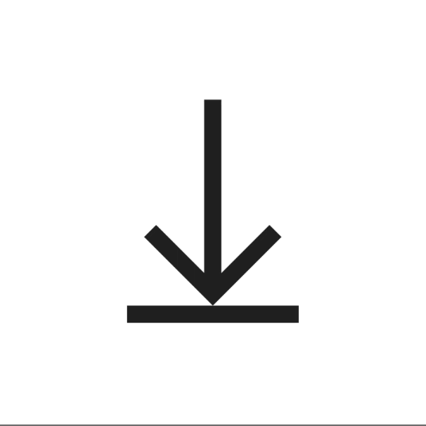
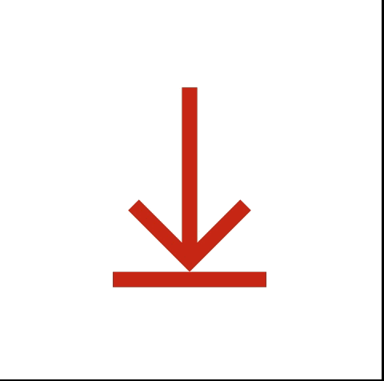
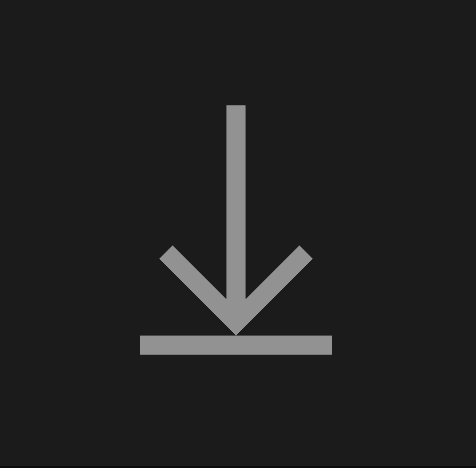
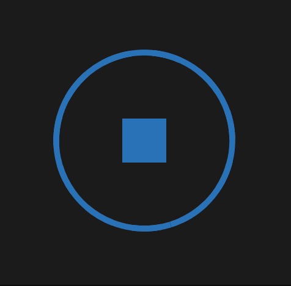
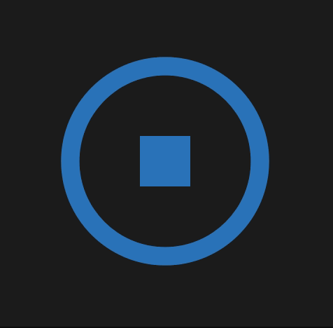
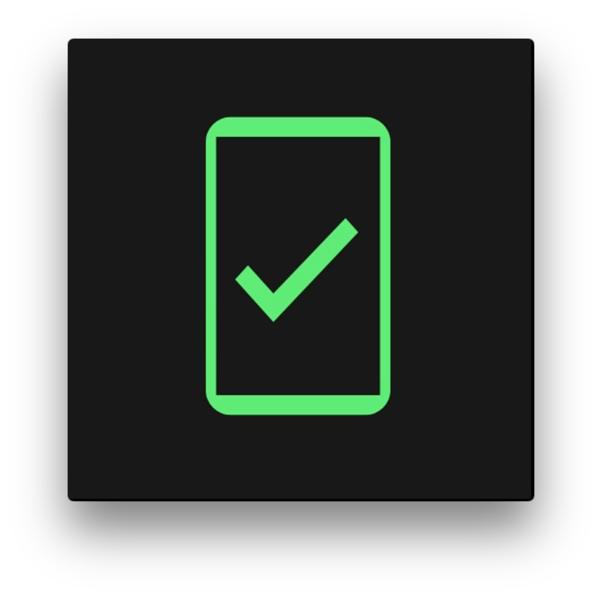
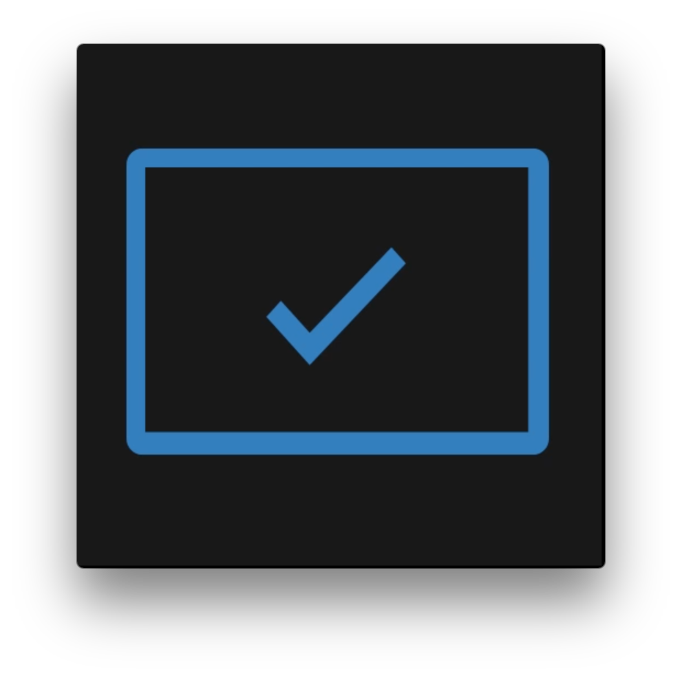
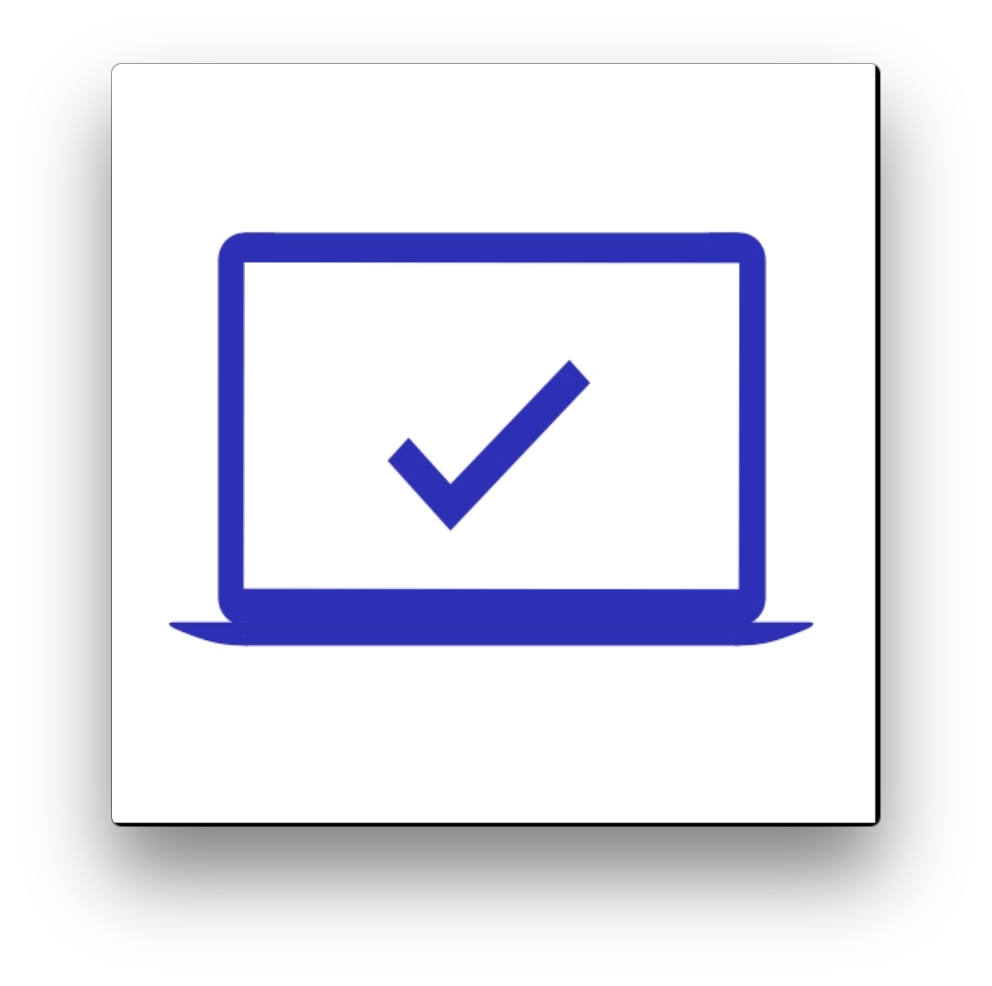
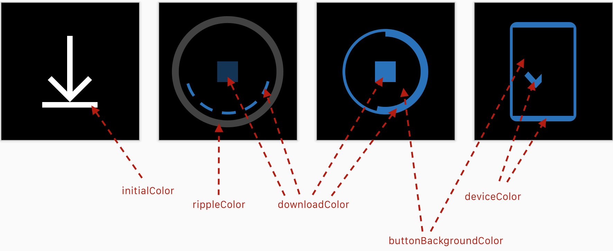
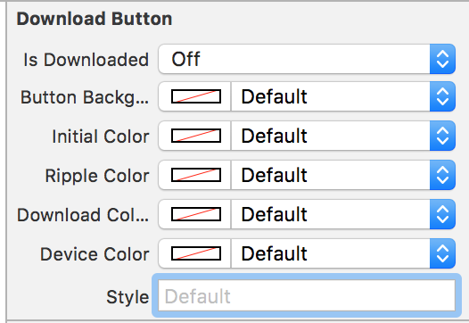

## DownloadButton

| || | |
|:-:|:-:|:-:|:-:|
|  |  |   |  |

[](https://github.com/LeonardoCardoso/NFDownloadButton#requirements-and-details)
[](https://github.com/LeonardoCardoso/NFDownloadButton#cocoapods)
[](https://github.com/LeonardoCardoso/NFDownloadButton#carthage)

> Revamped Download Button

- [Requirements](#requirements)
- [Installation](#installation)
- [Usage](#usage)
- [License](#license)

## Requirements

- iOS 8.0+
- Swift 3.0+
- Xcode 8.0+

## Installation

### CocoaPods

[CocoaPods](http://cocoapods.org) is a dependency manager for Cocoa projects. You can install it with the following command:

```bash
$ gem install cocoapods
```

> CocoaPods 1.1.0+ is required to build DownloadButton 0.0.1+.

To integrate DownloadButton into your Xcode project using CocoaPods, specify it in your `Podfile`:

```ruby
source 'https://github.com/CocoaPods/Specs.git'
platform :ios, '8.0'
use_frameworks!

pod 'NFDownloadButton', '~> 0.0.1'
```

Then, run the following command:

```bash
$ pod install
```

### Carthage

[Carthage](https://github.com/Carthage/Carthage) is a decentralized dependency manager that automates the process of adding frameworks to your Cocoa application.

You can install Carthage with [Homebrew](http://brew.sh/) using the following command:

```bash
$ brew update
$ brew install carthage
```

To integrate DownloadButton into your Xcode project using Carthage, specify it in your `Cartfile`:

```ogdl
github "LeonardoCardoso/NFDownloadButton" ~> 0.0.1
```

### Manually

If you prefer not to use either of the aforementioned dependency managers, you can integrate DownloadButton into your project manually.

## Usage

You can use a `DownloadButton` on [Storyboards](#storyboard) or, if you want to do it programatically, you can create it just like you create a UIView:

```swift
let downloadButton = DownloadButton(frame: CGRect(x: 0, y: 0, width: 50, height: 50))
self.parentView.addSubview(downloadButton)
downloadButton.draw() // <- don't forget to call this function
```

`DownloadButton` has four states:

| State 1: To Download | State 2: Will Download | State 3: Ready to Download | State 4: Downloaded |
|:-:|:-:|:-:|:-:|
|  |  |   |  |

You can switch between states by just doing as following:

```swift
self.downloadButton.downloadState = .toDownload || .willDownload || .readyToDownload || .downloaded
```

When the button is in `.readyToDownload` state, the button will wait for your to upload its progress. You can do it like this:

```swift
self.downloadButton.downloadPercent = 0.5
```
When this value reaches 1.0, then `downloadState` is automatically changed to `.downloaded`.

### Downloaded by default

You can select the button as downloaded by default. All states will be overridden by `Downloaded` state and no animation will be performed. To do so, just add `isDownloaded` in its constructor, or set it up whenever you want.

```swift
DownloadButton(frame: CGRect(x: 0, y: 0, width: 50, height: 50), isDownloaded: true)
```
```swift
downloadButton.isDownloaded = true
``` 

### Style

`DownloadButton` has four different styles of devices: `iOS`, `watchOS`, `tvOS`, `macOS`. Thus you can customize your final result. This option is only available on constructor.

```swift
DownloadButton(frame: CGRect(x: 0, y: 0, width: 50, height: 50), isDownloaded: true,
    style: .iOS)
```
| iOS | watchOS | tvOS | macOS |
|:-:|:-:|:-:|:-:|
|  |  |   |  |

### Palette

You also can customize the colors of the button on its constructor.

```swift
DownloadButton(
    frame: wrapView.frame,
    isDownloaded: true,
    style: .iOS,
    palette: Palette(
        initialColor: UIColor?,
        rippleColor: UIColor?,
        buttonBackgroundColor: UIColor?,
        downloadColor: UIColor?,
        deviceColor: UIColor?
    )
)
```



### Delegate

You can watch changes of state by implementing the protocol:

```swift
protocol DownloadButtonDelegate {

    func stateChanged(button: DownloadButton, newState: DownloadButtonState)

}
```

### Interface Builder / Storyboard

Last but not least, you can customize `DownloadButton` properties right from Interface Builder or Storyboards. 



## License

DownloadButton is released under the MIT license. See [LICENSE](https://github.com/LeonardoCardoso/NFDownloadButton/blob/master/LICENSE) for details.
